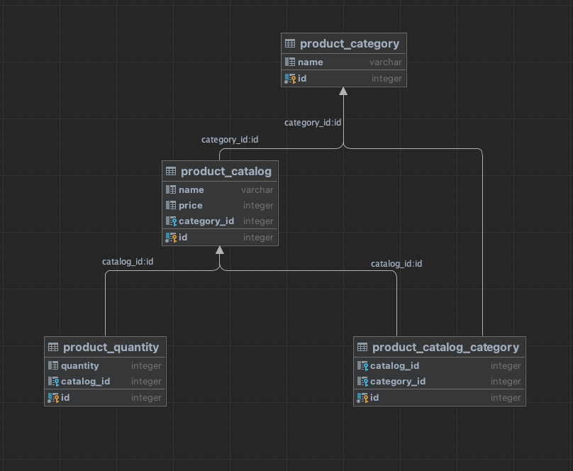

# Benchmarking Db Joins vs Making Multiple calls

### Technologies
1. Docker
2. Go v1.19.1
3. PostgreSQL v14.1
4. Docker & Docker compose

### How to run
`make {ROOT_DIR}/benchmark`

### Database

### What is tested

1. Using joins: Getting product details from catalog table  and inner joining the catalog_category table to get the
   product category and inner joining the quantity table to get the product quantity
2. Making three different calls to the category table, catalog_category and quantity table and aggregating the data
   at the service level
3. Making same calls as 2. but async using goroutines

## Results
Environment: Macbook Pro, M1 Pro, 32GB RAM

1. Using joins proved to be the fastest at around 1908445 ns/op
2. Making three different calls async came in second at around 2202548 ns/op
3. Making three different calls sync was the slowest at around 5964640 ns/op

Using Joins was 54% faster than making 3 calls async and 78% Faster than making 3 different calls sync

** Note this test only fetches one product and not multiple
